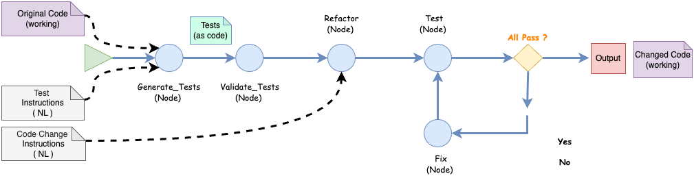

# Codemorf-AI: NL-Guided Code Transformation Tool

## Introduction

**Codemorf-AI** is an experimental tool for AI-driven code transformation based on natural language inputs. 
Built with  [LangGraph](https://github.com/langchain-ai/langgraph), it serves as a research sandbox for exploring how LLMs 
can transform code according to natural language instructions and verify changes using NL-defined tests.

## What could it be used for

This project is designed as a testbed to explore:

1. **Hands-on** learning of AI workflows
2. **NL-to-Test Translation**: Methods and techniques for converting natural language descriptions of test cases into machine-executable code
3. **Environment Configuration**: How to establish appropriate testing environments for different types of source code
4. **LLM Performance Evaluation**: Benchmarking various models on their ability to understand test requirements and transform code accordingly

## Core Workflow

Codemorf-AI implements a straightforward workflow:

   - Convert NL test descriptions into executable test code
   - Transform the original code based on NL instructions
   - Verify all tests pass
   - If errors occur, fix the code and retest until success



## Getting Started

```bash
# Clone the repository
git clone https://github.com/yourusername/codemorf-ai.git
cd codemorf-ai

# Set up environment
export OPENAI_API_KEY="your_api_key"  # Or other LLM API key

# Run a simple example
cd examples/python-single-file
./run-example.sh docker
```

## Experimentation Areas

### Workflow Definition

main code to check is here:

[workflow.py](src/core/workflow.py)

[workflow_state.py](src/core/workflow_state.py)

Options to try:

- Add new node(s) for something like "test environment initialization". 
So that the same environment can persist over all iterations until success

### Test Case Translation and Code transformation 

Node: [test_generate](src/core/nodes/test_generate)

Node: [code_modify](src/core/nodes/code_modify)

Options to try:

- Prompt engineering techniques
- Chain-of-thought reasoning
- Few-shot learning examples
- Template-based generation

### Test Execution

Node: [test_execute](src/core/nodes/test_execute)

Option to try:

- Simple Python functions
- Command-line tools
- Web APIs
- Data processing scripts

### LLM Evaluation

Try to implement process for how to measure and compare different models'.

Something like:

- Success rate in passing tests with limited number of iterations
- Number of iterations required
- Code quality metrics ( How? )
- Efficiency of solutions ( How? )


## License

[Apache License Version 2.0](LICENSE)
